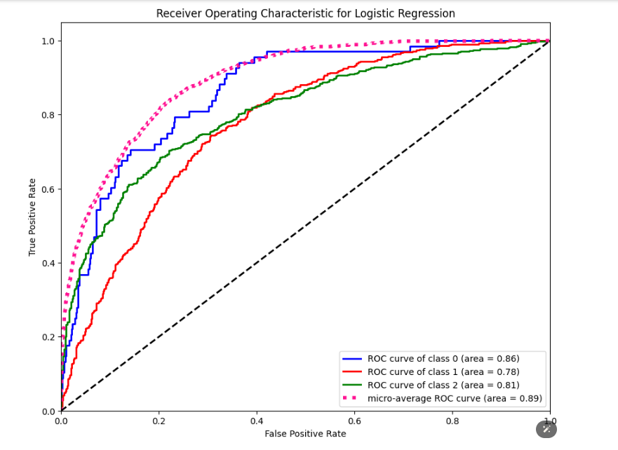

# Advanced Text Analysis with NLTK and Scikit-Learn



## Mission
The mission of this project is to build a robust natural language processing (NLP) system that can perform text analysis and sentiment classification using NLTK and Scikit-Learn. The goal is to explore the effectiveness of various machine learning models in classifying text data.

## Motivation
The motivation behind this project is to leverage advanced NLP techniques to analyze and classify text data efficiently. By understanding the sentiment of textual data, businesses can gain insights into customer feedback, improve services, and make data-driven decisions.

## Use Case
The primary use case for this project is sentiment analysis of customer feedback. This can be applied to reviews, social media posts, and customer service interactions to gauge public opinion and improve customer satisfaction.

## Tech Stack
- **NLTK**: Used for text preprocessing, tokenization, and stopword removal.
- **Scikit-Learn**: Utilized for feature extraction, model building, and evaluation.
- **Pandas**: For data manipulation and handling.
- **Matplotlib & Seaborn**: For data visualization and analysis.
- **WordCloud**: For generating word clouds to visualize text data.

## How to Run the Project
To run the project, follow these steps:

### Clone the Repository
```sh
git clone https://github.com/boss2256/Advanced-Text-Analysis-NLTK-Scikit-Learn.git
cd Advanced-Text-Analysis-NLTK-Scikit-Learn
```
## Run the Analysis
Execute the Jupyter notebooks to preprocess the data, train the models, and perform sentiment analysis.

## Challenges and Limitations
### Challenges
- **Data Imbalance**: The dataset had an imbalanced distribution of sentiment labels, which affected the model's ability to accurately predict minority classes.
- **Misclassification**: Certain phrases, such as "I HATE THIS," were incorrectly classified as positive due to the model's limitations in understanding context and sarcasm.
- **Model Selection**: Choosing the best-performing model required extensive experimentation with different algorithms and hyperparameters.

### Limitations
- **Limited Data**: The model was trained on a limited dataset, which may not generalize well to unseen data.
- **Static Data**: The model predictions are based on historical data and may not perform well on real-time data without periodic retraining.
- **Contextual Understanding**: The model sometimes fails to grasp the context of the text, leading to incorrect sentiment classification.

## Results

### Model Performance
The following models were evaluated for sentiment classification:

- **Logistic Regression**: Achieved an accuracy of 72%.
- **Random Forest**: Achieved an accuracy of 68%.
- **Gradient Boosting**: Achieved an accuracy of 70%.

Despite the challenges and limitations, the models provided valuable insights into the sentiment distribution of the dataset.

## Learning Points
- **Data Preprocessing**: Emphasized the importance of cleaning and preprocessing text data for better model performance.
- **Feature Engineering**: Highlighted the role of TF-IDF vectorization in capturing the significance of words.
- **Model Evaluation**: Underlined the need for thorough evaluation and comparison of different models to select the best one for the task.

## Conclusion
This project demonstrated the potential of using NLTK and Scikit-Learn for advanced text analysis and sentiment classification. While there were challenges and limitations, the project provided valuable insights and laid the foundation for future improvements and applications in NLP.
